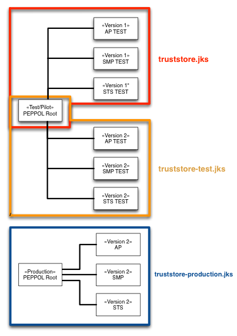

# Certificates, keys and key stores in Oxalis

The purpose of this document is to guide you in how to set up your PEPPOL certificates in order to make Oxalis "tick".


## What are certificates used for?

PEPPOL has defined a PKI structure which allows for prudent governance of the access points, the SMP's and so on.

Every low level message passed between access points and between the access point and the SMP, are signed with digital certificates.

The PKI structure comes in two releases:

* V2 is the current PKI scheme (as of autumn 2013)
* V1 is the old "PILOT" scheme and should no longer be needed (will be removed in later releases)

There is a "test" and "production" hierarchy of certificates.
The PEPPOL test root certificate were identicial for V1 and V2.



When your certificate is issued by PEPPOL, it will be signed with the *intermediate* AP certificate.

The long and short of this is: you have 3 trust stores in Oxalis holding the following chain of certificates:

1. V2 Production certificates, which has a production "root" CA.
1. V2 Test certificates, having a test "root" CA
1. V1 Pilot/Test certificates (sharing the test "root" CA as V2)


## How are they used in Oxalis?

Oxalis comes with all of the three trust stores included.

You need only to supply with your own key store, holding the private key and the corresponding PEPPOL certificate with your public key embedded.

This key store, which I refer to as the `oxalis-keystore.jks` should be placed in the `OXALIS_HOME` directory and references in your `oxalis-global.properties`


## How do I obtain a PEPPOL certificate for my Access point?

1. Sign a Transport Infrastructure Agreement (TIA) with a PEPPOL authority. Once that is done, you will receive instructions on how to submit a certificate signing request (CSR).
1. Create your own keystore `oxalis-keystore.jks` holding your private key and your self-signed certificate
1. Send a Certificate Signing Request (CSR) to PEPPOL.
1. You will receive a signed certificate with your public key.
1. Import the signed certificate into the key store (`oxalis-keystore.jks`)
1. Copy the `oxalis-keystore.jks` to your OXALIS_HOME directory.
1. Verify the configuration entry in `oxalis-global.properties`


## How do I specify PRODUCTION or TEST certificates?

You should only be running with version 2 certificates for test and production.

This is a snippet of the `oxalis-global.properties` that enables PRODUCTION use :

    # Location of keystore holding our private key AND the certificate with the public key
    oxalis.keystore=/Users/thore/.oxalis/oxalis-production-v2.jks

    # Which version of the PKI system are we using, should be V2 (which is also the default)
    oxalis.pki.version=V2

    # Mode of operation? Specify TEST for pilot/test certificate or PRODUCTION for production (defaults to TEST)
    oxalis.operation.mode=TEST


The `oxalis.keystore` property references the certificate used for **signing** and **sending** a message or **returning a receipt**.  It should always reference your local keystore holding the private key, your public key and PEPPOL certificate.


## How do I create such a keystore?

Sorry, that is outside the scope of this document, but if you have a look at the file `keystore.sh`, which is part of Oxalis, you should get the idea.

  There are many ways to skin a cat; some people prefer *openssl*, gui tools like *portecle* or
  other native tools supplied by their operating system.

  The first methods that spring to my mind are:

  * Use *openssl* togehter with Java *keytool* command
  * Java *keytool* only.  Import the PEPPOL and intermediate certificates into your keystore, **before** you import the signed certificate returned from PEPPOL.
  * Find some other tool more to your liking, like for instance Keystore Explorer ( http://www.lazgosoftware.com/kse/index.html )


### Using openssl together with keytool

When using *openssl(1)*, all the files are generated using *openssl* after which they are imported into a Java
keystore (JKS) using the Java *keytool* utility.

 1. Create the private key and the Certificate Signing Request as described
       [Certificate Signing Request (CSR) Generation Instructions for Apache SSL](https://knowledge.verisign.com/support/ssl-certificates-support/index?page=content&actp=CROSSLINK&id=AR198)

 1. Read our certificate together with our private key and export both of them into a PKCS12 file:

    ```
    openssl pkcs12 -export -in $our_certificate -inkey ${private_key_unencrypted_file} \
        -out ${tmp2} -passout pass:${password} -name ${aliasname}
    ```

 1. Import our private key and certificate from the PKCS12 formatted file into Java keystore:

    ```
    keytool -importkeystore -srckeystore ${tmp2} -srcstoretype PKCS12 -srcstorepass ${password} \
        -alias ${aliasname} -destkeystore $keystore_file -deststorepass peppol
    ```

    Do not specify a password for the entry itself, only for the keystore.


### Using the Java keytool only

This method requires is for masochists only, so I shall give no detailed instructions.

  1. You must create the keystore and the CSR as described earlier.

  1. Import the PEPPOL root certificate and the intermediate certificates into the keystore.

  1. Import the PEPPOL signed certificate into the keystore.

  1. Best of luck!


## Verify the contents of your keystore

 You should verify the following aspects of your keystore using the keytool command :
 
    ```
    $ keytool -list -v -keystore keystore.jks 
    Enter keystore password:  
    
     Keystore type: JKS
     Keystore provider: SUN
     
     Your keystore contains 1 entry
     
     Alias name: ap-test
     Creation date: May 29, 2013
     Entry type: PrivateKeyEntry               <<<<<< !!! NOTE !!!  
     Certificate chain length: 1
     Certificate[1]:
     Owner: CN=APP_1000000001, O=SendRegning, C=NO
     Issuer: CN=PEPPOL ACCESS POINT TEST CA, OU=FOR TEST PURPOSES ONLY, O=NATIONAL IT AND TELECOM AGENCY, C=DK
     Serial number: 5ac7a5e47aab6c5967ba8f42d52f5d95
     Valid from: Wed May 29 02:00:00 CEST 2013 until: Sat May 30 01:59:59 CEST 2015
     Certificate fingerprints:
    ```
    
 * There is only a single entry in the keystore with a type of **PrivateKeyEntry**
 * The password of the keystore corresponds to the contents in your `oxalis-global.properties`
