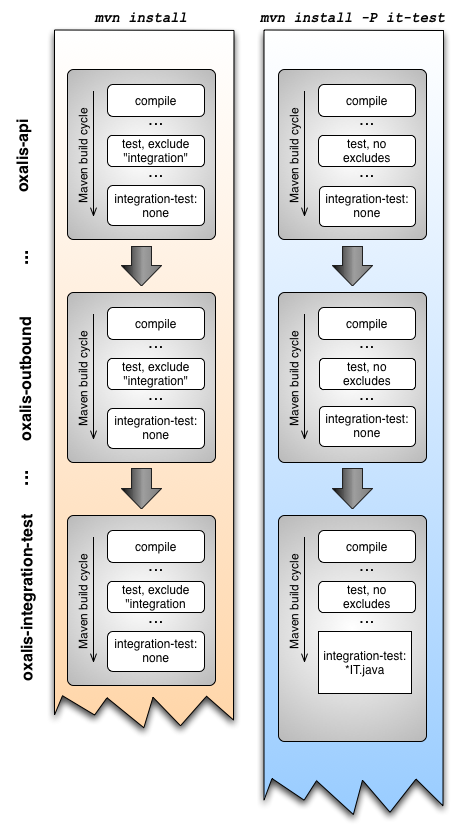

# Organizing the source for testing

## BACKGROUND

Oxalis consists of many modules or components, some of which have requirements like being deployed in a JEE container,
connection to a RDBMS and access to the filesystem in order to retrieve certificates, keys, storage of inbound messages etc.

## THE CHALLENGE

New users simply wish to download and compile the software with a single command like for instance "mvn clean install".
However; this will execute all unit tests in the maven "test" phase.
Henceforth; any standard unit test, must not require access to any external resources like databases or running JEE-containers.

How can we organize the code in order to handle a) plain simple unit tests, b) integration tests requiring access to
installed resources like X509 certificates etc. and a RDBMS and c) tests that require a running JEE-container?

## TOOLS OF THE TRADE

Currently the ubiquitous tool for building Java based systems is Maven. The building process is highly configurable
through the declaration of "plugins" in the pom.xml.

Building any component with Maven consists of executing a bunch of tasks within every "phase" of the build lifecycle.

Let me give you a quick recap of the most important phases in chronological order:

 * validate - validate the project is correct and all necessary information is available.
 * compile	- compile the source code of the project.
 * test - run tests using a suitable unit testing framework. These tests should not require the code be packaged or deployed.
 * integration-test - process and deploy the package if necessary into an environment where integration tests can be run.
 * install - install the package into the local repository, for use as a dependency in other projects locally.
 * deploy - done in an integration or release environment, copies the final package to the remote repository for
            sharing with other developers and projects.

Traditionally tests have been named *Test.java and executed by the Surefire-plugin in the "test" phase.

To accomodate external dependencies on resources like databases, JEE-containers, file systems etc., the build process
has been split into several "profiles". The idea being that you if you simply execute "mvn clean install", the simple unit
tests are executed, while specifying a profile like for instance "mvn clean install -P it-test" has executed
all the complicated integration- and function tests.

## THE OXALIS SOLUTION

Basically I wanted to handle the following cases:

a) A new users should be able to compile and build Oxalis without any prerequisite conditions.
b) Once the $OXALIS_HOME directory has been created, all "integration" tests, except those requiring a running JEE
   container should be executed. The $OXALIS_HOME directory contains resources like for instance the PEPPOL
   X509 certificates, log configuration files, .properties file etc.
c) The full fledged functional tests, depending upon a JEE-container, should be executed once at the end of the build cycle.

I wanted to fire up the JEE container before the functional integration test and tear it down afterward, due to the fact that
my code is not bug free :-) I.e. if tests fail due to missing .jar files, invalid configuration files, I wanted to remedy the
problem and re-execute the tests.

In the past we have executed "integration tests" using the traditional Surefire plugin. However in the "test" phase, the code
must not be packaged nor deployed!

To ensure that unit tests requiring access to external resources are not executed during a normal build,
annotating them and excluding them is the trick. Basically I simply annotate the test
with `@Test(groups = {"integration"})`, after which I exclude them from the ordinary build process like so:

    <build>
        <pluginManagement>
            <!-- Declarations in this section will be inherited to all child projects -->
            <plugins>
                <plugin>
                    <artifactId>maven-surefire-plugin</artifactId>
                    <version>2.14.1</version>
                    <configuration>
                        <!-- Don't execute tests requiring the presences of keystores, config files etc. -->
                        <!-- Nor do we execute the tests that require manual inspection -->
                        <excludedGroups>integration,difi,manual</excludedGroups>
                    </configuration>
                </plugin>
                 ................

The exclusion of tests will be inherited to all child projects, which is exactly what I want. Please note the groups "manual", which indicates tests to be executed manually, which I find quite usefull.

But how can we execute the integration tests and the functional tests?

My solution is to utilize profiles and the "Failsafe" plugin.

## PROFILES

By having profiles activated by either a command line switch or the "<activation>" tags, we can control what should be
executed.

By including this in my pom.xml, I locate the required configuration file:

    <!-- Inspects the file system to locate the oxalis-global.properties file, which -->
    <!-- is required for integration tests -->
    <profile>
        <!-- Activated if the environment variable OXALIS_HOME has been set -->
        <id>oxalis-config-from-env</id>
        <activation>
            <file>
                <exists>${env.OXALIS_HOME}/oxalis-global.properties</exists>
            </file>
        </activation>
        <properties>
            <oxalis.config.present>true</oxalis.config.present>
            <oxalis.configuration.file>${env.OXALIS_HOME}/oxalis-global.properties</oxalis.configuration.file>
        </properties>
    </profile>
    <profile>
        <!-- Activated if ~/.oxalis/oxalis-global.properties has been found -->
        <id>oxalis-config-from-default-dir</id>
        <activation>
            <file>
                <exists>${user.home}/.oxalis/oxalis-global.properties</exists>
            </file>
        </activation>
        <properties>
            <oxalis.config.present>true</oxalis.config.present>
            <oxalis.configuration.file>${user.home}/.oxalis/oxalis-global.properties</oxalis.configuration.file>
        </properties>
    </profile>

Basically this will ensure that the property `oxalis.configuration.file` has been populated, if a proper installation
and configuration has been performed. To verify this, execute this command:

	mvn -N help:active-profiles

Which yields:

	.......
	The following profiles are active:

	 - ssl (source: external)
	 - sendregning (source: external)
	 - oxalis-config-from-env (source: no.difi.oxalis:oxalis:3.1.0-SNAPSHOT)
	 - oxalis-config-from-default-dir (source: no.difi.oxalis:oxalis:3.1.0-SNAPSHOT)
	.....

Which allows me to utilize the "enforcer-plugin" to enforce that required files are in place.

## THE FAILSAFE PLUGIN

The "Failsafe" plugin binds to three phases of the build lifecycle; pre-integration-test, integration-test and post-integration-test. This allows me to fire up the JEE container in the pre-integration-test phase, execute the tests in the "integration-test" phase and finally tear down the JEE container in the "post-integration-test".

The important issue here is tearing down the JEE container, even if some of your testes fail! As implied by the name "Failsafe", this plugin will not fail the build until after the "post-integration-test", which is very usefull.

Furthermore; the "Failsafe" plugin will only execute tests with a suffix of "IT", i.e. test classes named "SimpleTest" will not
be executed, while tests named "SimpleTestIT" will be executed.

The net effect is that all ordinary unit tests will be executed by Surefire during the "test" phase, while integration tests will only by executed by "Failsafe" during the "integration-test" phase.

## DEPICTION OF BUILD CYCLES AND PHASES

The following depicts the difference between the two variants of the build life cycle:

Remember; the main logic of building a Maven project goes something like this:

    foreach module
        validate

        compile

        test by executing all *Test classes, except those marked "integration" or "manual"

        integration-test; Surefire does not bind to this phase so nothing happens

        install

    end foreach

Using profiles and the Failsafe-plugin, we have another build cycle, which is activated by the profile "it-test":

    foreach module

        validate

        compile

        test by executing all *Test classes, except those marked "manual"

        pre-integration-test; Cargo-plugin fires up embedded Tomcat

        integration-test; Failsafe-plugin executes all *IT classes

        post-integratino-test; Cargo-plugin tears down embedded Tomcat

        verify; runs any checks to verify the package is valid and meets quality criteria.

        install

    end foreach
